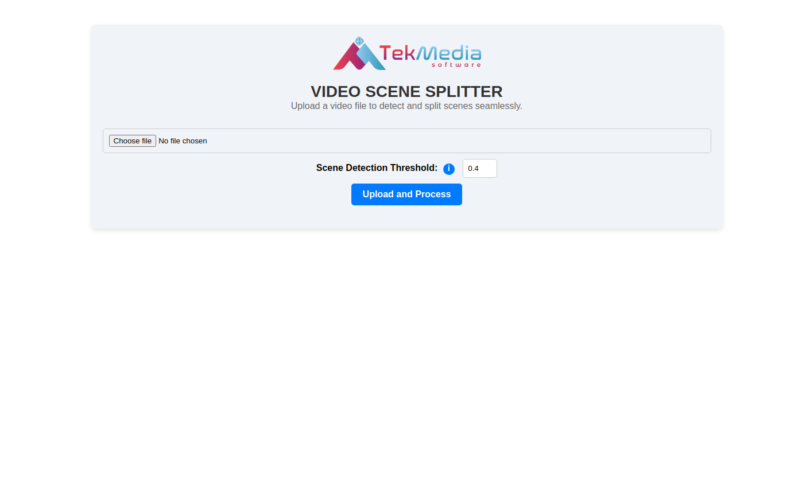
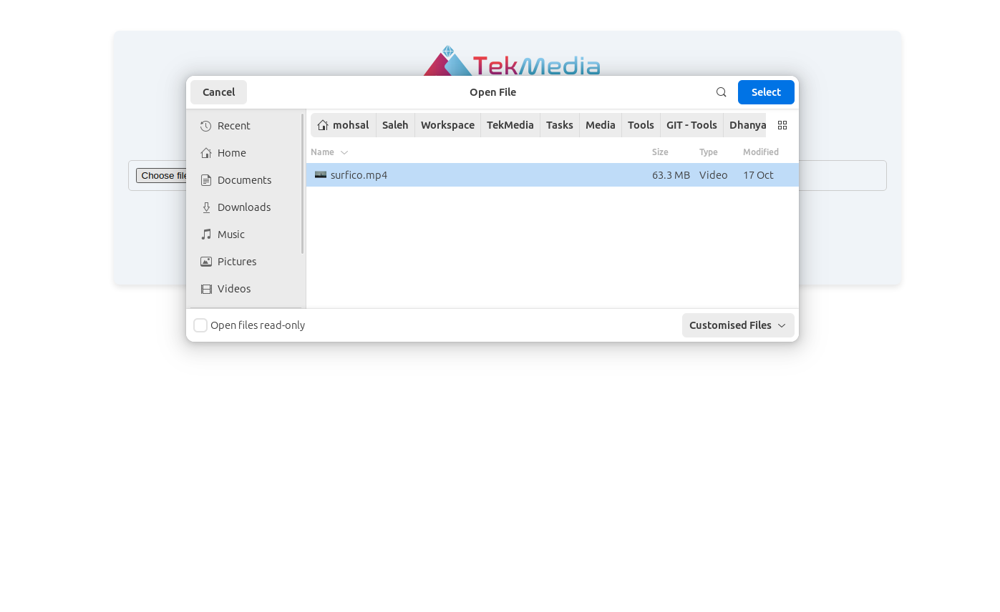
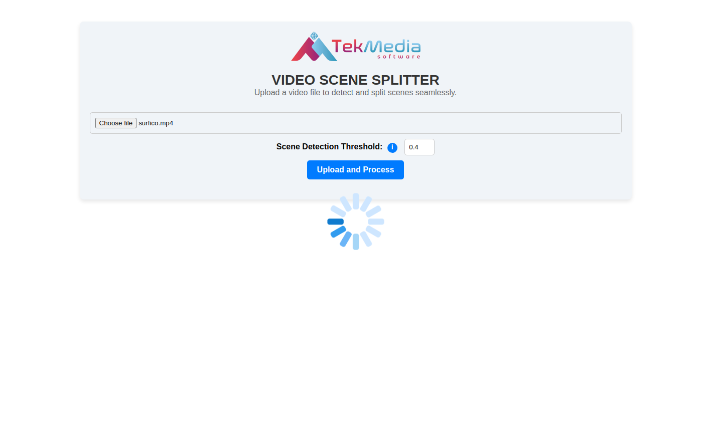
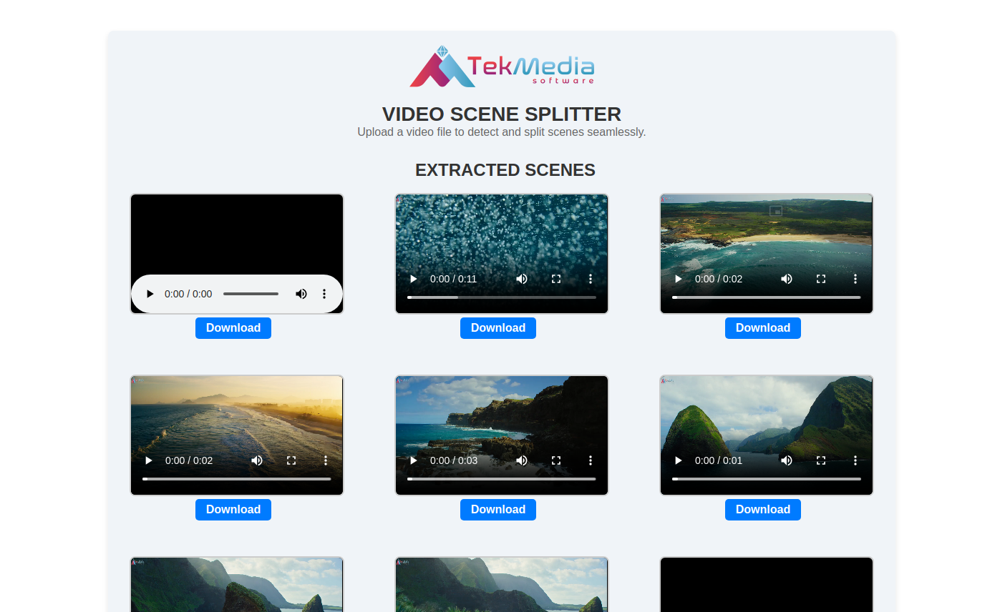
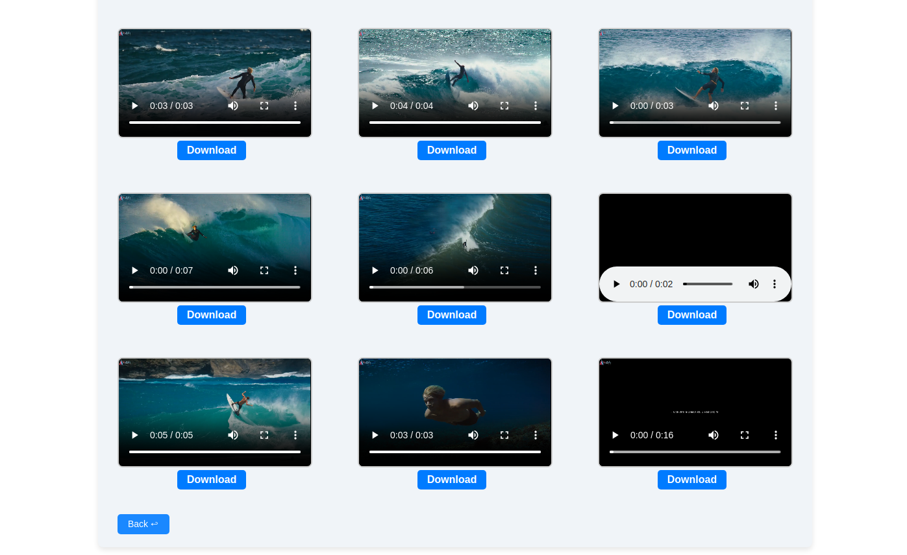

# TekMedia's Video Scene Splitter

A graphical user interface (GUI) tool to detect scene changes in a video and split it into smaller clips using FFmpeg. The goal is to provide an easy way to extract distinct scenes from a video file, based on scene change detection, and make these scenes available for download.

This tool is ideal for various use cases like:

- Movie Editing: Quickly split a movie into individual scenes for review or editing.
- Surveillance Video Analysis: Extract key moments from a long surveillance video.
- Content Creation: Isolate specific scenes from videos for use in highlight reels or montages.


## Steps

**1. Clone the repository and move to project directory**
 
```
git clone https://github.com/TekMedia-Software/Video-Scene-Splitter.git
```
```
cd Video-Scene-Splitter
```


**2. Install required Python packages**
 
- If pip is not installed, you can install it using:
```
sudo apt install python3-pip
```

- Then, install Flask
```        	
pip install flask
```
 

**3. Check if FFmpeg is installed correctly**

```        
ffmpeg -version
```
      
- If FFmpeg is not installed, you can install it using:
```	
sudo apt update
```
```
sudo apt install ffmpeg
```
- You can also download from [FFmpeg's official website](https://www.ffmpeg.org/download.html).

      
**4. Run the project**

- Start the Flask server:
```
python app.py
```     

- Open http://localhost:5000 in browser.      


## Usage

- Upload a Video File:
  - The application supports .mp4, .avi, .mov, .ts and .mkv video files. Click the "Choose File" button to select a video.

- Adjust Scene Detection Threshold:
  - You can customize the threshold value to control the sensitivity of scene change detection. A lower value will detect more subtle changes, while a higher value will only detect major changes.

- Process the Video:
  - Click the "Process" button to start scene detection and splitting. The tool will analyze the video, detect scene changes, and split the video into individual scenes.

- View and Download Scenes:

  - Once processing is complete, the split scenes will be displayed on the UI with options to play and download each scene. The scenes are saved with filenames in the format <original_video_name>_scene_<number>.mp4.
	
### UI Parameters Usage Descriptions:

  - Scene Detection Threshold: Adjust this value to control the sensitivity of the scene detection. A lower threshold will detect more scenes, while a higher threshold will only detect significant scene changes.
  - Video Player: The UI provides an embedded video player for each scene, allowing you to review the split scenes before downloading.


## Screenshots












## Contact 

For any questions or feedback, please reach out:

- Awadh Bajpai - [awabaj@tekmediasoft.net](mailto:awabaj@tekmediasoft.net)
- Dhanya Saminathan - [dhasam@tekmediasoft.net](mailto:dhasam@tekmediasoft.net)


## Contributing

We welcome contributions! Please see the [CONTRIBUTING.md](CONTRIBUTING.md) file for detailed guidelines on how to contribute to this project.

## License

This project is licensed under a proprietary license. All rights reserved. You may modify and use this software for personal purposes, but for any production use, reproduction, modification, or distribution, prior written permission from [**TekMedia Software Services**](https://tekmediasoft.com) is required.
